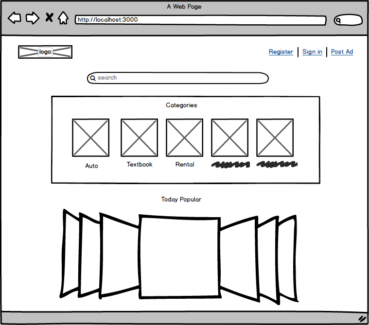
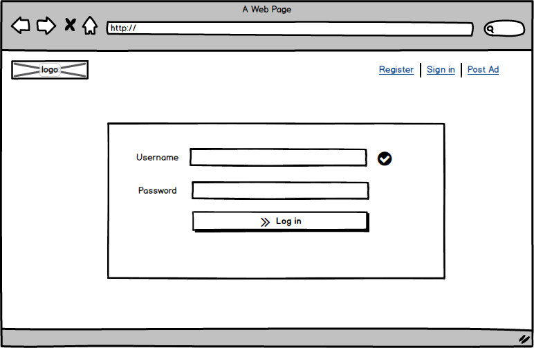

# CPSC436I_Project
CPSC436I_Project 

## Project Description

### Who is it for?
People with needs to exchange second-hand goods.
### What will it do? (What "human activity" will it support?)
Users will be able to search, buy, and sell items.
Users will also be able to manage their items for sale.
### What type of data will it store?
* User data
    * avatar
    * username
    * password
* Item data
    * picture
    * title
    * description
    * price
    * date (posting date and/or expired date)
Item information is arranged by user and by category.
### What will users be able to do with this data?
* For user data: users will be able edit their profile. 
* For item data: users will be able to add new items and modify (edit and delete) existing items.
### What is some additional functionality you can add/remove based on time constraints?
* Group(community) module
* virtual currency module

## Project task requirements

### 3-5 minimal requirements & "standard" requirements
* Sign up & Log in (minimal)
* Post new items (minimal)
* Search items (minimal) based on some filters (standard)
* Render items that meet the requirement onto the website (minimal)
* Display a specific item (i.e., photo, description, price, posted date) (standard)
* Edit & delete existing item (standard)
### 2-3 stretch requirements (hope to complete 1!)
* Write tests for most functions
* Comment and rate items
* Automatically remove goods from the list after the expiration time set by the website
* User group of specific subcategory
* Virtual currency system

## Mockup
### Index

### Login

### List items in one category

### List one item

